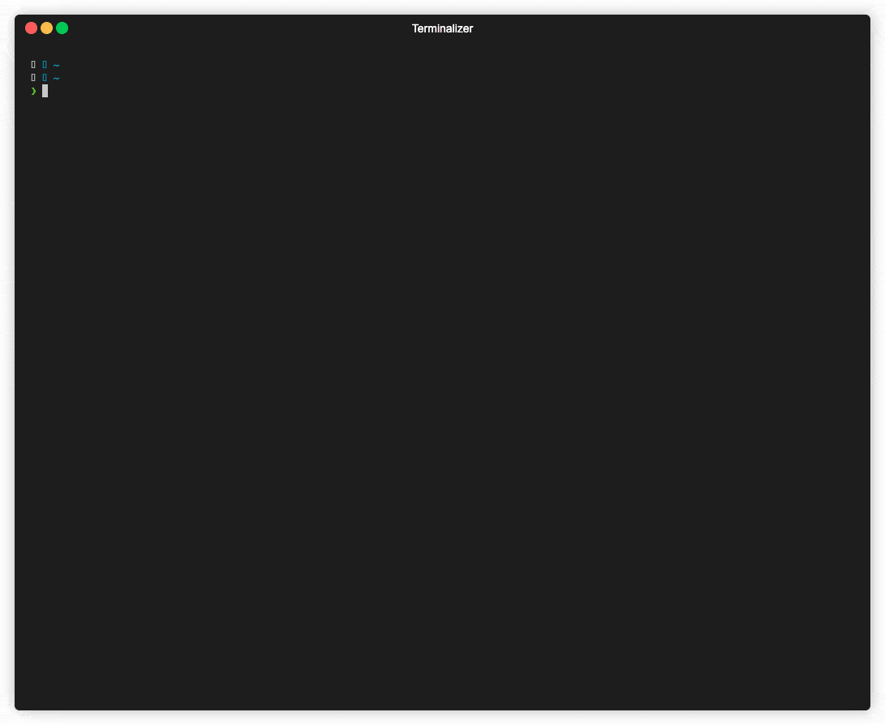

#  helmYAMLizer


[](https://github.com/psf/black)
[](https://pypi.org/project/helmYAMLizer)
 

Adopting a minimalistic approach to rendering multi-document YAML produced by the `helm template` output into local
files. In line with GitOps practices, a shallow or non-nested structure for saved YAML is preferred to ensure better
visibility and clarity. 

Users can choose to leave out certain labels from the generated YAML. For instance, they might decide not to include
the `app.kubernetes.io/managed-by: Helm` label. They also have the ability to generate a `kustomization.yaml` file, 
which will list all the processed HELM chart YAML files as resources.

```text
./helmYAMLizer.py --help
usage: helmYAMLizer.py [-h] -d DIR [--drop-label-keys [DROP_LABEL_KEYS ...]] [-k] [--debug]

options:
  -h, --help            show this help message and exit
  -d DIR, --dir DIR     The directory where files will be saved.
  --drop-label-keys [DROP_LABEL_KEYS ...]
                        List of metadata label keys to remove.
  -k, --kustomize-generate
                        Should we generate a kustomize file?
  --debug               Should we run the script in debug mode?
```

### Usage

```shell
# helm repo add ingress-nginx https://kubernetes.github.io/ingress-nginx && helm repo update
pip install helmYAMLizer
helm template ingress-nginx/ingress-nginx | helmYAMLizer --dir 'nginx'
```

With docker image:

```shell
# helm repo add prometheus-community https://prometheus-community.github.io/helm-charts && helm repo update
docker pull ghcr.io/violetcranberry/helmyamlizer:latest && mkdir prom-stack

helm template prometheus-community/kube-prometheus-stack | \
  docker run -iv $(pwd)/prom-stack:/prom-stack ghcr.io/violetcranberry/helmyamlizer:latest \
  --dir 'prom-stack'
```

With shell:

```shell
# helm repo add gloo https://storage.googleapis.com/solo-public-helm && helm repo update
pip install ruamel.yaml
helm template --include-crds gloo/gloo | \
  python <(curl -sL https://raw.githubusercontent.com/VioletCranberry/helmYAMLizer/main/helmYAMLizer.py) \
  --dir 'gloo'
```

Demo:


For additional examples, refer to the `examples` directory.

### The problem

Advocates of immutable infrastructure often favor [Kustomize](https://github.com/kubernetes-sigs/kustomize) over 
[Helm](https://github.com/helm/helm/tree/main) because of its strictly declarative nature, stable configurations,
independence from chart repositories, and lack of a templating system. Yet, not all chart creators offer resources 
in Kustomize-friendly formats. In such instances, the only alternative might be the `helm template` command.

### The strategy

The Helm [RenderSources](https://github.com/helm/helm/blob/main/pkg/action/action.go#L106) function responsible 
for templating, tags the source of rendered templates with `#Source: <yaml_path>`. In the resulting multi-document YAML,
each YAML document is demarcated by `---` followed by the template's origin / source comment. 

The complete multi-document YAML is seen as a sequence of dictionaries. Each of these begins with `---`, 
followed by a `helm template` source comment. This comment reveals the location for the related chart template. 
From this source comment, we can determine the absolute location for a specific document. The `RenderSources` function
also guides us in shaping the final structure:

1. If the path commences with `crds/`, it remains unchanged.
2. If the path contains `/templates/`, only the part after this segment is returned. This ensures no extra folders are
created while still preserving any existing nested structure, if present.

### `helm template` issues

The `helm template` command can sometimes produce incorrect YAML, given its inherent delimiters and lack of validation.
This might result in the generation of blank or incorrect YAML sections. For instance, an empty YAML document might
appear sandwiched between two legitimate ones, or documents may be incomplete.  

In these situations, consistently generating dependable YAML becomes difficult since we can't always rely on source
comments for validation and path creation. If there are sections of problematic YAML, users will be alerted with a 
warning.

In the context of using the `helm template` command with the `--output-dir` parameter, the resultant output creates a
deeply-nested hierarchy of rendered templates, charts, and their associated CRDs. This intricate structure compromises
clarity and visibility, making it challenging to swiftly locate and access the intended resources.


### Dependencies

[ruamel.yaml](https://pypi.org/project/ruamel.yaml/) - serves as a versatile alternative to PyYAML, offering advantages 
like comment preservation, key order retention, and compatibility with the YAML 1.2 specification, as opposed to PyYAML's 
limited compatibility with YAML 1.1.
